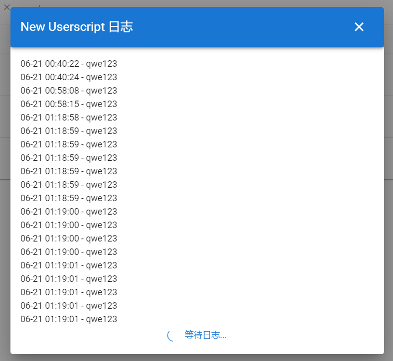
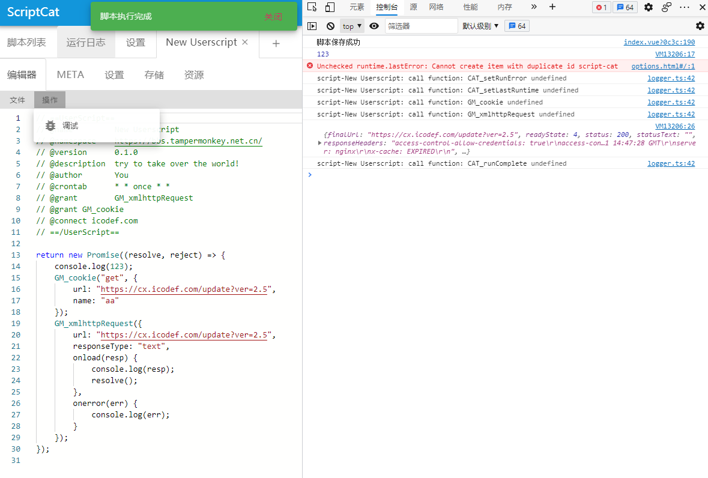

# 后台脚本

> 后台脚本适用于持续运行类型的脚本.后台脚本是脚本猫特有的脚本.


## 后台脚本

后台脚本由`@background`属性声明,后台脚本将允许在开启脚本或者浏览器启动后,让脚本在后台持续运行.


## 定时脚本

> 定时脚本也属于后台脚本的一种,定时脚本适用于每隔一段时间执行一次的脚本.

定时脚本由`@crontab`属性声明,可以精确到秒级调用,提供了一个`once`参数,表示某个时间段内会执行一次(考虑浏览器未打开的情况).建议脚本的运行时间和重试时间不要大于定时时间的间隔.

可使用在线工具测试cron表达式,扩展中的`once`替换成`*`:[cron在线测试](https://tool.lu/crontab/)

在控制台页面,鼠标放置`运行状态`栏时会显示下一次的运行时间.


### Crontab 例子

```javascript
//@crontab * * * * * * 每秒运行一次
//@crontab * * * * * 每分钟运行一次
//@crontab 0 */6 * * * 每6小时的0分时执行一次
//@crontab 15 */6 * * * 每6小时的15分时执行一次
//@crontab * once * * * 每小时运行一次
//@crontab * * once * * 每天运行一次
//@crontab * 10 once * * 每天10点检测运行一次
//@crontab * 10-23 once * * 每天10点后检测运行一次
//@crontab * once 13 * * 每个月13号中的每小时最多运行一次
```

## 日志

在脚本列表页面，鼠标放置`运行状态栏`会提示脚本的运行状态,点击可弹出通过`GM_log`打印的日志内容





## 脚本调试

后台脚本可直接在脚本编辑页面进行调试,但是存在下面问题: value无法正常同步,registerMenu菜单无法正常触发.



如果是运行的环境请前往扩展开启**开发人员模式**然后在点击扩展的background.html进行调试，运行时产生的错误也可以在运行日志中查看


## Promise

> 十分推荐这种写法,也便于脚本管理器的脚本监控

脚本返回`Promise`对象,管理器可以将返回的内容当作日志记录下来.

```ts
// ==UserScript==
// @name         后台脚本
// @namespace    wyz
// @version      1.0.0
// @author       wyz
// @background
// ==/UserScript==
return new Promise((resolve, reject) => {
  if (Math.round((Math.random() * 10) % 2)) {
    resolve("ok");// 执行成功
  } else {
    reject("error");// 执行失败,并返回错误原因
  }
});
```


```js
// ==UserScript==
// @name         每天运行一次的定时脚本
// @namespace    wyz
// @version      1.0.0
// @author       wyz
// @crontab      * * once * *
// ==/UserScript==
return new Promise((resolve, reject) => {
  if (Math.round((Math.random() * 10) % 2)) {
    resolve("ok");// 执行成功
  } else {
    reject("error");// 执行失败,并返回错误原因
  }
});
```

